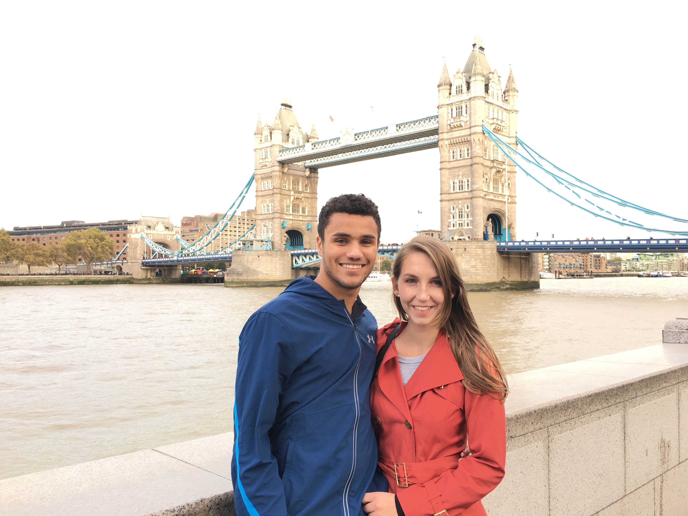
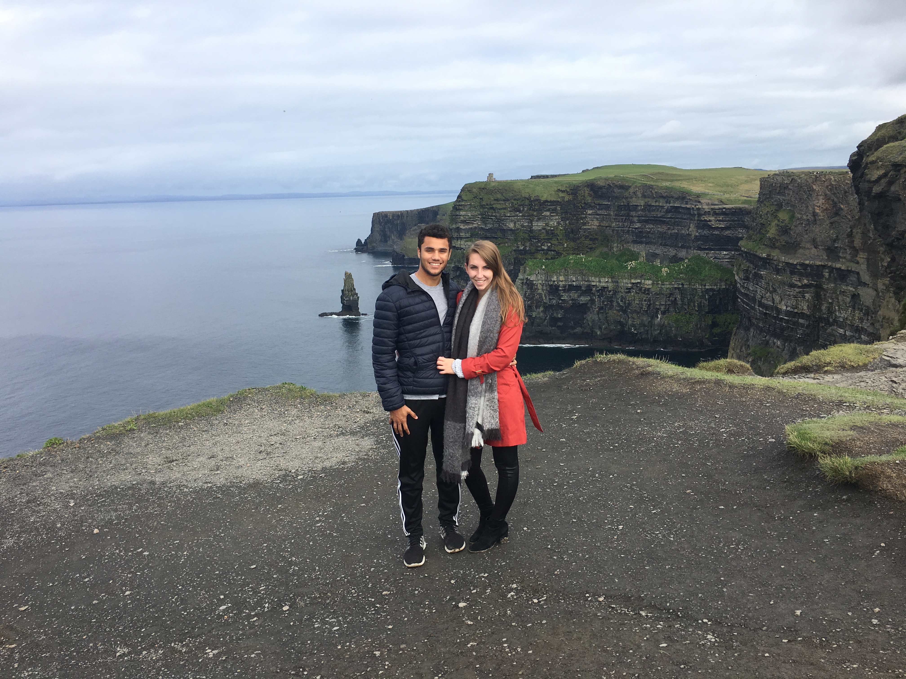

Hi Everyone! My name is Jess and I am part-time student at Columbia University working to earn my MS in Biostatistics. I also currently work full-time at Memorial Sloan Kettering Cancer Center (MSKCC) in the Department of Epidemiology and Biostatistics. My CV can be found here: 

My hobbies include reading, running, and traveling (pre-COVID!) with my amazing boyfriend shown below: 

